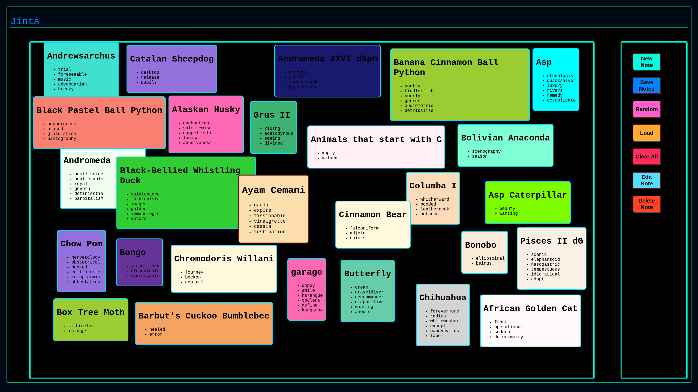

# JINTA - John's Incredible Note-Taking App

- **Jinta** is a webpage that you can run locally in your browser of choice (preferably Chrome).   It's purpose is to allow you to make notes about things, arrange them by dragging them around the screen, edit them, save them, reload them etc..
- For development purposes, e 'Random' button can be clicked to produce a bunch of random notes.

- To use it, just clone the repo and open `index.html` in your browser.

# TODO

- Edit not working fully.
- Allow tagging and filtering
- Allow display as a table
- Allow links

